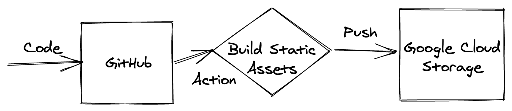

+++
author = "Ian Crosby"
title = "Building a Static Website"
date = "2021-02-20"
description = "Does this make me full stack?"
tags = [
    "tech",
]
series = ["Learning-Tech"]
image = "patrick-tomasso-GfDyRbLofHg-unsplash.jpg"
+++

Having spent my career in tech between backend software development and infrastrucutre, the front end has always seemed like black magic to me. So when deciding to setup my own site I was a bit intimidated and also determined to not touch or see any css whatsover. As my previous experience can be summed up below:

In addition to my no-css rule, I had a view other requirements:

* Cheap
* Portable
* Minimal
* Markdown support
* Full CI/CD
* Entirely automated

Luckily, there are a plethora of wonderful and easy to use frameworks nowadays. After a quick search I opted for the following tech stack:

* GitHub (as CMS)
* Hugo
* GitHub Actions (for CI/CD)
* Google Cloud Storage for hosting static content

I sketched out a basic architecture/flow diagram of what I was planning to build:

First step was to setup the basic site with Hugo. This is straightforward, simply following the Hugo [quick start guide](https://gohugo.io/getting-started/quick-start/) and choosing a theme. Hugo also makes local development extremely simple.

After that I setup a Google Cloud Storage bucket. If you have your own domain (as in my case), you can connect that domain directly with a storage bucket. This requires you to create a CNAME record that points to c.storage.googleapis.com. After that's created you can create the bucket via the gsutil command line tool:

    gsutil mb -c standard -l northamerica-northeast1 gs://www.my-domain.com

`-c` specifies the storage class
`-l` specifies the location/region

Next up is setting up the CI/CD, which in this case is simply building the static assets and pushing them to a Google cloud storage bucket. I specifically chose to use GitHub actions because I've been looking for an excuse to try them out.

